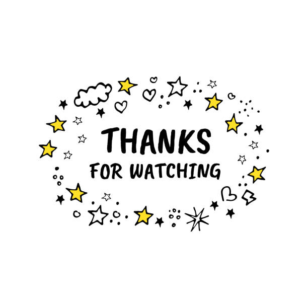

<html>
	
	<head>
		<meta charset="utf-8">
		<title>Amigo secreto</title>
		
		<link href="CSS/CSS.css" rel="stylesheet" type="text/css">
	</head>
	<body marginheight="50" marginwidth="50" background="Imagen/fondo.avif">
		

			
Hola amiga secreta, soy "<strong>54,75,20,61,6d,69,67,6f,20,73,65,63,72,65,74,6f,20,3a,76,2c,20,50,69,73,74,61,3a,20,76,65,20,61,6c,20,75,6c,74,69,6d,6f,20,63,6f,6d,65,6e,74,61,72,69,6f</strong>", ¿Como va todo?, espero que bien, como esta semana es virtual decidi hacer una pagina web, asi como las que hacemos en clase de computación, espero que te llege a gustar la mini pagina que hize y que te valla bien en este poco tiempo que falta para que termine el año, y luego vacaciones!!!, ya falta poco asi que alegrate, y para llenar la pagina decidi poner un video de messi cantando un coro de navidad ya que falta tecnicamente solo 1 MEESS!!! 

		

		

			<iframe width="400" height="200" src="https://www.youtube.com/embed/3GYu3WbK2m8?si=CinKJcF5nivcRSuG" title="YouTube video player" frameborder="0" allow="accelerometer; clipboard-write; encrypted-media; gyroscope; picture-in-picture; web-share" referrerpolicy="strict-origin-when-cross-origin" allowfullscreen>
			</iframe>
		

		

			

				
			

		

	</body>
</html>
