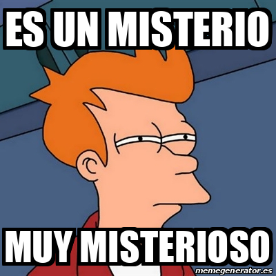

<html>
<head>
<meta charset="utf-8" name="viewport" content="width=device-width, initial-scale=1.0">
<title>Prueba</title>

<link href="CSS/css.css" rel="stylesheet" type="text/css">

</head>
<body>

  
&nbsp;

  
Hola amiga secreta, espero que hallas logrado descubrrir el pequeño asertijo que deje la anterior semana, y si no, no importa porque era algo troll, esta vez si va a ser de verdad, pero necesitaras desifrar un pequeño acertijo, si lo logras podras estar 1 paso mas cerca de saber quien soy, o no, ¿quien sabe?, te deseo mucha suerte.

<strong style="font-size: xx-large">Carta virtual para mi amigo secreto!!!</strong>

	

<strong>4c,6f,79,20,44,61,20,4b,69,64,64,20,2d,20,54,75,20,4d,69,72,61,20,66,74,2e,20,40,62,61,64,6b,72,69,70,70,79</strong>

</body>
</html>
